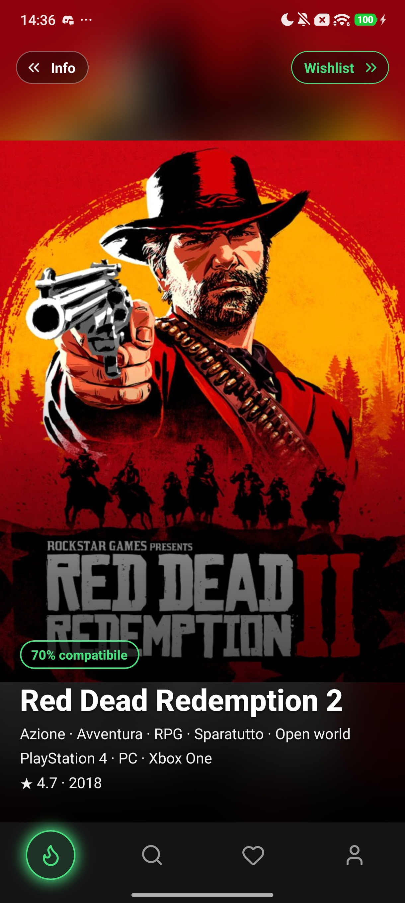
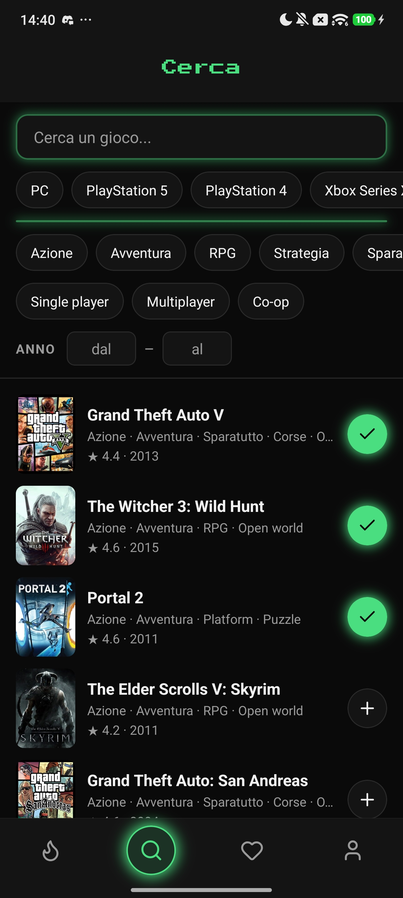
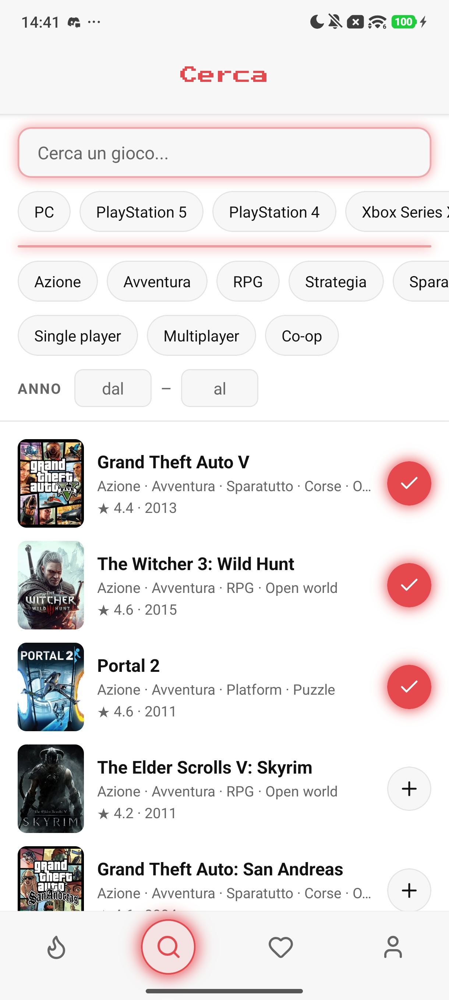
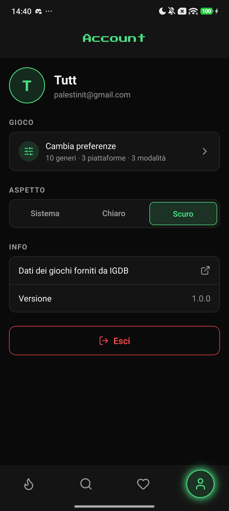
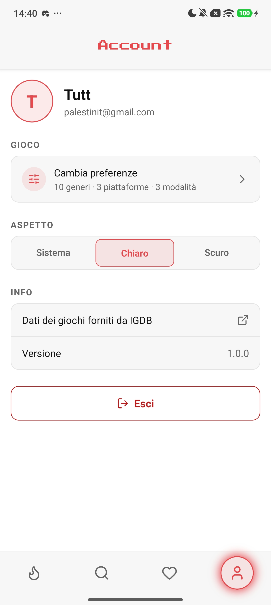
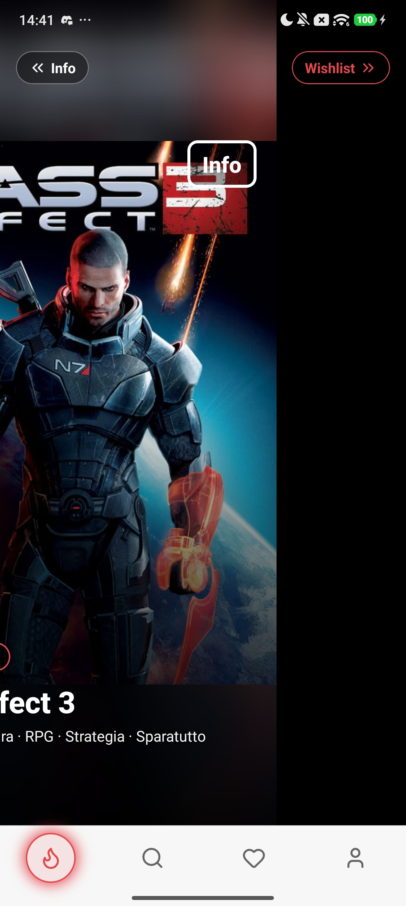
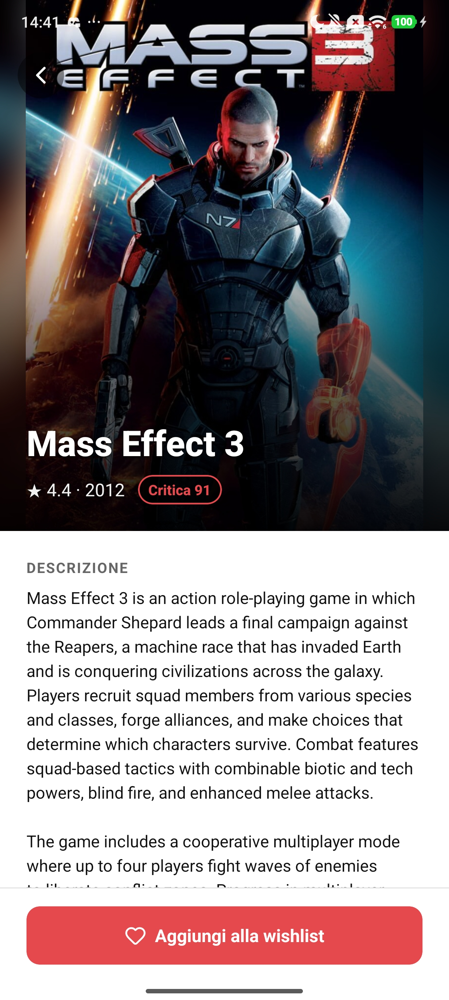
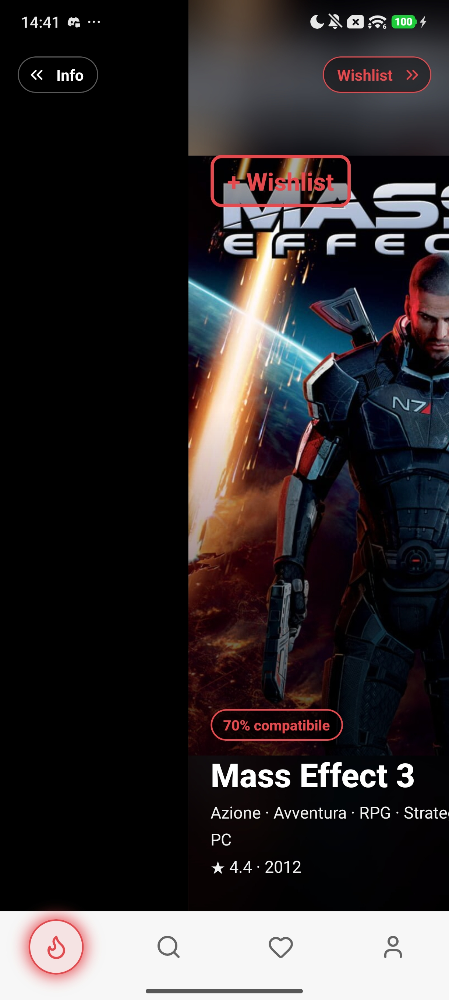
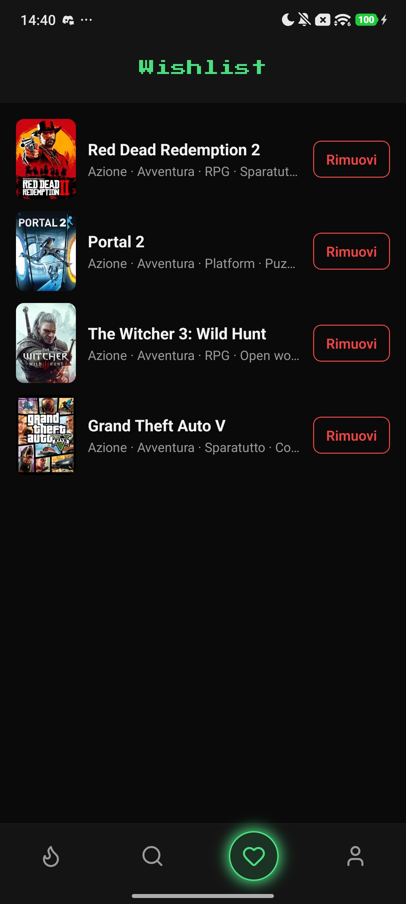
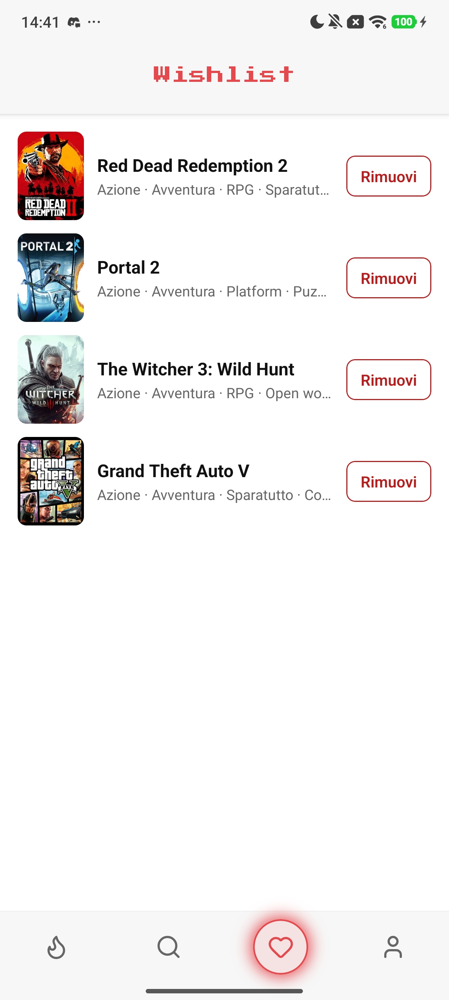

# GameFeedApp

App mobile React Native per scoprire videogiochi con un feed verticale stile TikTok.
Si scelgono generi, piattaforme e modalità di gioco, e il feed propone i giochi
dal più compatibile al meno compatibile. Con uno swipe si aggiungono alla wishlist
o si aprono le informazioni.

Progetto del corso ITS Prodigi.

<p>
  
  
  
  
  
  
  
  
  
  
</p>

## Architettura

Il progetto è diviso in **due repository**, entrambi necessari per provare l'app:

| Repository | Contenuto |
|---|---|
| [GameFeedApp](https://github.com/Tommaso-Palestini/GameFeedApp) (questo) | App mobile React Native |
| [backend-app-game-feed](https://github.com/Tommaso-Palestini/backend-app-game-feed) | Backend Node/Express |

```
App (telefono)  ──►  Backend (PC, porta 3000)  ──►  API IGDB (online)
                          │
                          └── account utenti (file JSON)
```

L'app non chiama IGDB direttamente: passa dal backend, che custodisce le credenziali,
traduce i filtri, calcola la compatibilità e gestisce gli account.

## Funzionalità

- **Onboarding**: scelta di generi, piattaforme e modalità (single player, multiplayer, co-op), con chip animati
- **Feed infinito**: giochi ordinati per compatibilità con le preferenze, caricati a pagine mentre si scorre
  - swipe a destra → aggiunge alla wishlist
  - swipe a sinistra → apre il dettaglio
  - quando i giochi compatibili finiscono compare un avviso, poi il feed continua con giochi casuali
- **Cerca**: ricerca per nome (anche parziale) con filtri per piattaforma, genere, modalità e anno, e scroll infinito
- **Wishlist**: elenco dei giochi salvati, con animazioni quando si aggiunge o si toglie
- **Dettaglio**: copertina, descrizione, sviluppatori, voto della critica, generi, piattaforme e modalità
- **Account**: registrazione e accesso con email e password; preferenze e wishlist vengono salvate sull'account
- **Uso come ospite**: preferenze e wishlist salvate sul telefono; registrandosi passano al nuovo account
- **Impostazioni**: tema chiaro / scuro / di sistema, modifica delle preferenze, uscita dall'account
- **Tab bar** personalizzata con indicatore "slime" animato e transizione animata per il login

## Stack

- React Native 0.87 (CLI, senza Expo) + TypeScript
- React Navigation (native stack + bottom tabs)
- Animazioni con `Animated` di React Native
- `react-native-svg` + `lucide-react-native` per icone e sfumature
- `@react-native-async-storage/async-storage` per tema, sessione, preferenze e wishlist
- Font Press Start 2P (licenza OFL) per i titoli

## Requisiti

- Node 22.11 o superiore
- JDK 17
- Android Studio con Android SDK Platform 35 e Build-Tools 36.0.0
- Variabile d'ambiente `ANDROID_HOME` configurata
  (su Linux di solito `export ANDROID_HOME=$HOME/Android/Sdk` e `platform-tools` nel `PATH`)
- Un telefono Android con il debug USB attivo, oppure un emulatore Android
- Credenziali Twitch per il backend (Client ID e Client Secret): istruzioni nel
  [README del backend](https://github.com/Tommaso-Palestini/backend-app-game-feed#credenziali)

## Provare l'app, passo per passo

### 1. Backend

Clona e avvia il backend seguendo il suo README:
[backend-app-game-feed](https://github.com/Tommaso-Palestini/backend-app-game-feed#installazione).
In breve: clone, `npm install`, file `.env` con le credenziali Twitch, `npm run dev`.

Prima di proseguire controlla che risponda su `http://localhost:3000/api/health` con `{"ok":true}`.

### 2. App

In un altro terminale:

```bash
git clone https://github.com/Tommaso-Palestini/GameFeedApp.git
cd GameFeedApp
npm install
```

Collega il telefono via USB (o avvia un emulatore) e controlla che sia visto:

```bash
adb devices
```

Rendi raggiungibile il backend dal telefono:

```bash
adb reverse tcp:3000 tcp:3000
```

Avvia Metro:

```bash
npm start
```

In un terzo terminale, sempre nella cartella `GameFeedApp`, compila e installa l'app:

```bash
npx react-native run-android
```

La prima compilazione richiede qualche minuto.

### 3. Uso

- Non ci sono account già pronti: si può usare l'app **come ospite** oppure creare un account
  da **Account → Accedi o registrati → Registrati** (email valida, password di almeno 8 caratteri)
- Per provare la sincronizzazione: registrati, aggiungi giochi alla wishlist, esci e rientra
  (anche da un altro dispositivo collegato allo stesso backend)

### Problemi comuni

- **"Impossibile caricare il feed"**: il backend non è acceso, oppure manca `adb reverse tcp:3000 tcp:3000`
  (va ripetuto ogni volta che il telefono viene scollegato)
- **`adb devices` non mostra il telefono**: attiva il debug USB e accetta il popup sul telefono
- **Errore "SDK location not found"**: `ANDROID_HOME` non è configurata

L'indirizzo del backend si cambia in `src/api/config.ts`.

## Dove trovare i requisiti nel codice

| Requisito | Dove |
|---|---|
| `useState`, `useEffect` | tutte le schermate in `src/screens/`, per esempio `FeedScreen.tsx` e `CercaScreen.tsx` |
| React Navigation | `src/navigation/RootNavigator.tsx` (stack) e `src/navigation/MainTabs.tsx` (tab) |
| `useContext` | `src/theme/ThemeContext.tsx` (tema chiaro/scuro), `src/context/AccountContext.tsx` (login), `PreferenzeContext.tsx`, `WishlistContext.tsx` |
| Stile | tema in `src/theme/tema.ts`, stili con `StyleSheet` in ogni schermata |
| Backend di terze parti | API IGDB, chiamata tramite il backend; client in `src/api/` |

## Struttura

```
src/
├── api/            client HTTP (timeout, annullamento, errori) e chiamate al backend
├── components/     card del feed, tab bar, chip, effetti LED, popup, ecc.
├── context/        account, preferenze e wishlist condivisi tra le schermate
├── data/           elenchi di generi, piattaforme e modalità
├── hooks/          useDebounce, usePulsazione
├── navigation/     stack principale, tab e tipi di navigazione
├── screens/        Onboarding, Login, Feed, Cerca, Wishlist, Dettaglio, Account
├── storage/        lettura e scrittura dei dati salvati sul telefono
├── theme/          palette chiara e scura, spazi, raggi, ThemeContext
├── utils/          funzioni di supporto
└── types.ts        tipi Game, DettaglioGioco, Preferenze
```

## Ottimizzazioni

- **Feed e ricerca a pagine**: i giochi vengono caricati un blocco alla volta mentre si scorre
- **Precaricamento** delle copertine delle card successive a quella visibile
- **`React.memo`** sulle card del feed: si ridisegnano solo quando cambiano i loro dati
- **FlatList configurata** per tenere montate poche card alla volta (`windowSize`, `removeClippedSubviews`)
- **Debounce** della ricerca: la richiesta parte solo quando si smette di scrivere
- **Annullamento** delle ricerche superate con `AbortController`
- **Immagini in due formati**: piccole per le liste, grandi solo per feed e dettaglio

## Limiti attuali

- Il recupero della password non è ancora disponibile
- Gli account sono gestiti dal mini backend in un file JSON, senza database
- Le descrizioni dei giochi sono in inglese, perché IGDB non ha testi in italiano
- Il backend gira in locale: il telefono deve essere collegato al PC

## Sviluppi futuri

- Collegamento al backend del progetto full stack, con database e hosting online
- Libreria personale dei giochi posseduti, esclusa automaticamente dal feed
- Collegamento con Steam per importare la libreria
- Recupero della password via email
- Stato dei giochi (da giocare, in corso, finito) e voto personale multicriterio
- Sincronizzazione in tempo reale tra dispositivi
- Descrizioni dei giochi tradotte in italiano
- Build di release firmata e pubblicazione su Play Store

## Riferimenti

- [React Native – Documentazione](https://reactnative.dev/docs/getting-started)
- [React Native – Set Up Your Environment](https://reactnative.dev/docs/set-up-your-environment)
- [React Native – Animated](https://reactnative.dev/docs/animated)
- [React Navigation](https://reactnavigation.org/docs/getting-started)
- [React – useContext](https://react.dev/reference/react/useContext)
- [AsyncStorage](https://react-native-async-storage.github.io/async-storage/)
- [react-native-svg](https://github.com/software-mansion/react-native-svg)
- [Lucide Icons](https://lucide.dev)
- [IGDB API](https://api-docs.igdb.com)
- [Twitch Developer Console](https://dev.twitch.tv/console)
- [Press Start 2P su Google Fonts](https://fonts.google.com/specimen/Press+Start+2P)

## Crediti

Dati dei giochi forniti da [IGDB](https://www.igdb.com).